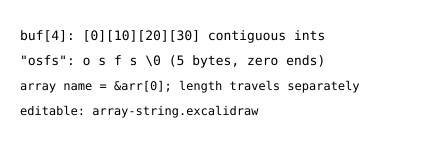

# Functions, Arrays, Strings — Passing Memory Around

> Functions borrow memory. Arrays *are* memory. Strings are arrays with a zero at the end.

**Type:** Learn
**Languages:** C
**Prerequisites:** 01-hello-c
**College ref:** OSTEP Ch.13 (address spaces use arrays), MIT 6.1810 C refresher (strings/argv), xv6 file kernel/string.c (memcpy/memmove you will meet)
**Time:** ~60 minutes

## Learning Objectives
- Trace args-by-value vs arrays-decay-to-pointer using a stack diagram
- Implement string length/copy/compare without `<string.h>` first, then compare to libc
- Explain why `arr[i]` can't know its own length and why `'\0'` terminates strings
- Connect buffers to OS ideas: argv, pathnames, `read()` buffers

## Concept in 60s



<!-- source: ../figures/array-string.excalidraw — open in excalidraw.com to redraw -->

You call `int add(int a, int b)` and the caller never notices — it gets *copies*, so writing `a` inside touches nothing outside. Pass an array to `void fill(int *arr, int n)` and everything changes. The array *decays* to the [address](../../../../glossary/terms.md#address) of element zero, so writes go through to the caller. A C string is a `char buf[N]` ending at the first `'\0'` zero byte. `strlen` counts until zero. `strcpy` copies until zero, *including* it. No length lives anywhere else. Forget the zero and every function runs off the end. That is the bug behind half of OS CVEs.

## Simulate It (host, no QEMU)

You drive all three rules at once. `code/main.c` passes values, arrays, and strings, then prints what changed where.

```c
#include <stdio.h>

int add(int a, int b) { return a + b; }

void fill(int *arr, int n) {
    for (int i = 0; i < n; i++) arr[i] = i * 10;
}

unsigned my_strlen(const char *s) {
    unsigned n = 0;
    while (s[n] != '\0') n++;
    return n;
}

int main(void) {
    int x = 5;
    int s = add(x, 3);
    printf("add: x=%d s=%d\n", x, s);

    int buf[4];
    fill(buf, 4);
    printf("buf: %d %d %d %d\n", buf[0], buf[1], buf[2], buf[3]);

    char name[] = "osfs";
    printf("name=%s len=%u\n", name, my_strlen(name));
    return 0;
}
```

What this does: proves value-args don't alias, array-args do, and strings are zero-terminated — the three memory rules for all later code.

| Lines | Code | Why it exists |
|---|---|---|
| 3 | `add(int a, int b)` | by-value: `a`/`b` are fresh [stack](../../../../glossary/terms.md#stack) copies; writing them never touches caller |
| 5–7 | `fill(int *arr, int n)` | `int *` + explicit length: arrays decay to [pointer](../../../../glossary/terms.md#pointer), so length must travel separately (no bounds checking in C) |
| 6 | `arr[i] = i*10` | sugar for `*(arr+i)`; writes land in *caller's* `buf` (P-01/03 in action) |
| 9–13 | `my_strlen` | counts until `'\0'`; `const` = "I promise not to write through `s`" |
| 16–17 | `add(x,3)` + print | `x` stays 5 after the call — proof of copying |
| 19–21 | `int buf[4]; fill(buf,4)` | `buf` = 16 contiguous bytes on stack; `buf` in the call = `&buf[0]` |
| 23 | `char name[] = "osfs"` | 5 bytes: `o s f s \0`; the hidden zero is what `my_strlen` hunts |

Change X → Y: change `fill(buf, 4)` to `fill(buf, 2)`. Verify: `make run` prints `buf: 0 10 <garbage> <garbage>` (last two uninitialized — proves `fill` only touched what you asked, nothing auto-zeros).

Then meet the battle-tested versions. Same contract, fewer surprises:

```c
#include <stdio.h>
#include <string.h>

int main(void) {
    char dst[16];
    strcpy(dst, "osfs");
    printf("libc: %s %zu %d\n", dst, strlen(dst),
           memcmp(dst, "osfs", 5));
    return 0;
}
```

What this does: repeats length/copy with `<string.h>` and proves byte-equality with `memcmp` — the exact trio xv6's `kernel/string.c` reimplements freestanding.

| Lines | Code | Why it exists |
|---|---|---|
| 5 | `strcpy(dst, "osfs")` | copies 5 bytes *including* `'\0'`; `dst` must fit (16 does) — overflow here = stack smash later |
| 6–7 | `strlen` + `memcmp(...,5)` | `strlen` excludes zero, `memcmp` compares raw bytes; `0` = identical |

Change X → Y: change `dst[16]` to `dst[4]` (exact fit: 4+zero=5 > 4). Verify: compiles, may run, but `-Werror` won't save you — this is *undefined behavior*, the exact bug AddressSanitizer/valgrind lessons will catch (preview, don't ship this).

## Build It (compile flags that catch string bugs)

```bash
cc -Wall -Werror -Wextra -std=c11 main.c -o build/fn && ./build/fn
cc -fsanitize=address,undefined -std=c11 main.c -o /tmp/fn-asan && /tmp/fn-asan | head -6
```

What this does: builds strict, then rebuilds with sanitizers that abort on overflow/use-after-scope with a precise report.

| Lines | Code | Why it exists |
|---|---|---|
| `-Wextra` | more warnings | catches unused params, sign compares — the maybe-bugs `-Wall` misses |
| `-fsanitize=address,undefined` | runtime guards | instruments every load/store; try the `dst[4]` overflow here and it screams instead of silently corrupting |

Change X → Y: keep `dst[16]`, add `dst[my_strlen(dst)] = '!';` then print. Verify: ASan stays quiet for `[4]` (the zero slot is yours) but fires if you write `[16]` — proves the valid range is `0..15`.

## Use It (Linux)

Look at argv in the wild — the OS handing `main` an array of strings:

```bash
./build/fn hello world
cat -A /proc/self/cmdline | tr '\0' ' '; echo
man 3 strlen | head -12
```

What this does: runs your binary with args (ignored for now — next step is reading them), shows how Linux stores args as zero-separated bytes, and opens the libc contract.

| Lines | Code | Why it exists |
|---|---|---|
| `./build/fn hello world` | args demo | `hello`/`world` arrive as `char *argv[]` once you declare `main(int argc, char **argv)` (exercise 2) |
| `cat -A /proc/self/cmdline` | zero-separated proof | `^@` = shown zeros between args; C strings ride on exactly this encoding |
| `man 3 strlen` | contract | return type, `NULL` behavior (undefined — never pass it), edge cases |

Change X → Y: replace `/proc/self/cmdline` with `/proc/$$/cmdline`. Verify: shows your shell's own argv — same encoding, different process (address spaces isolate, format is shared).

## Ship It

Artifact: `outputs/c-strings-card.md` — decay rule, zero rule, `strncpy` vs `strcpy` guidance, ASan one-liner. Reuse in every later lesson that touches pathnames or buffers. Pathnames and `read()` buffers will test it soon.

## Exercises

1. Easy — declare `main(int argc, char **argv)`, print each `argv[i]` with `my_strlen`. Run with 3 args, show output.
2. Medium — write `my_strcpy(dst, src, cap)` that never writes past `cap-1` and always zero-terminates. Prove with ASan + a too-long input.
3. Hard — implement `my_memcpy`/`my_memmove` (handle overlap in memmove). Diff behavior on overlapping copy vs `memcpy` (this is xv6 `string.c` — compare yours after).

## Key Terms

| Term | Plain meaning | Link |
|---|---|---|
| pointer | array name decays to address of element 0 | [pointer](../../../../glossary/terms.md#pointer) |
| stack | where `buf`, `name`, `x` live; gone at `}` | [stack](../../../../glossary/terms.md#stack) |
| heap | where big/long-lived buffers go (`malloc`) | [heap](../../../../glossary/terms.md#heap) |

## Further Reading

- `man 3 strcpy,strlen,memcpy` — contracts + BUGS sections (read the warnings once).
- xv6 `kernel/string.c` — 30 lines you'll fully understand after exercise 3.
